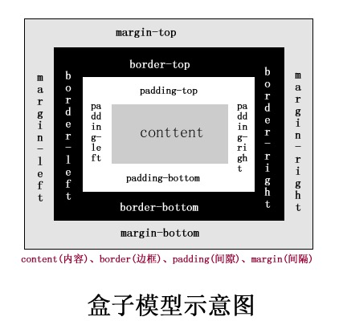

# 2. 盒模型

## 2.1 盒模型概念

盒模型也叫 盒子模型、框模型。

CSS将页面中所有元素都设置为了1个矩形的盒子。将元素设置为矩形的盒子后，对页面的布局就变成将不同的盒子摆放到不同的位置

`注意`: 1个盒子的 **可见框大小**，由内容区、内边框 和 边框 共同决定，所以在计算盒子大小时，需要将这三个区域加起来计算。

## 2.2 盒模型组成

每1个盒子由以下几个部分组成:



### 内容区(`content`):

概念: 元素中所有的子元素和文本都在内容区中排列

* 内容区大小由 `width` 和 `height` 2个属性来设置

### 内边距(`padding`)

概念: 内容区和边框之间的距离

### 边框(`border`)

概念: 属于盒子的边缘，边框里属于盒子内部，出了边框都是盒子的外部

`注意`: 边框大小会影响到整个盒子的大小。

要设置边框，需要至少设置3个样式:

* `border-width`: 边框宽度
* `border-color`: 边框颜色
* `border-style`: 边框样式

### 外边距(`margin`)

概念: 当前盒子和其他盒子之间的距离，决定盒子位置


## 2.3 边框: `border`

### `border-width`

作用: 边框宽度，可以用来指向4个方向边框的宽度，默认值3px。

```css
/*顺时针转动*/
border-width: 上 右 下 左

;
border-width: 上 左右 下

;
border-width: 上下 左右

;
border-width: 上下左右

;
```

除了 border-width，还有1组 border-xxx-width，单独指定某1个边框，如:

* `border-top-width`
* `border-left-width`
* `border-right-width`
* `border-bottom-width`

### `border-color`

作用: 指定边框颜色。同样可以指定4个边框的颜色，如上。

`border-color` 也可以省略不写，如果省略则自动使用 `color` 的颜色。

### `border-style`

作用: 指定边框样式。

* `solid`: 实线
* `dotted`: 点状虚线
* `dashed`:  虚线
* `double`: 双线

### border 简写属性

通过 `border` 属性可以设置边框所有的相关样式，并且没有顺序要求。

`注意`: 除了 `border` 外，还有 `border-xxx` 也可以使用简写属性。

```text
border: 宽度 颜色 样式;
```

```CSS
div {
    border: 10px orange solid;
}
```

问: 如果要设置3边的，其中1个不设置，如何优雅写出？

答: 一般是 `border` 设置四个边框，特殊需求再用 `border-xxx` 去重写覆盖。

```css
div {
    border: 10px red solid;
    border-right: none;
}
```


## 2.4 内边距: `padding`

概念: 内容区 和 边框之间的距离是内边距，规则和 `border-width` 差不多。

一共有4个方向的内边距:

* `padding-top`
* `padding-left`
* `padding-right`
* `padding-bottom`

### 特点

* 内边距的设置会影响盒子大小
* 背景颜色会延伸到内边距


## 2.5 外边距: `margin`
> `注意`: margin会影响到盒子实际占用空间大小。

作用: 外边距不会影响盒子可见框大小，但是外边距会影响盒子的位置。

元素在页面中，是按照自左向右的顺序排列的，所以默认情况下:
* 如果设置左和上外边距则会移动元素自身
* 设置下和右外边距会移动其他元素。

同样，有4个方向的外边距:
* `margin-top`: 上外边距
  * 设置正值，元素向下移动
* `margin-left`: 左外边距
  * 设置正值，元素向右移动
* `margin-right`: 右外边距
  * 默认情况下，margin-right 不会产生任何效果
* `margin-bottom`: 下外边距
  * 设置正值，其下边的元素会向下移动
    
margin: 设置负值，元素会向相反的方向移动

### margin 简写属性
margin 可以同时设置4个方向的外边距，用法和 `padding` 一样。
